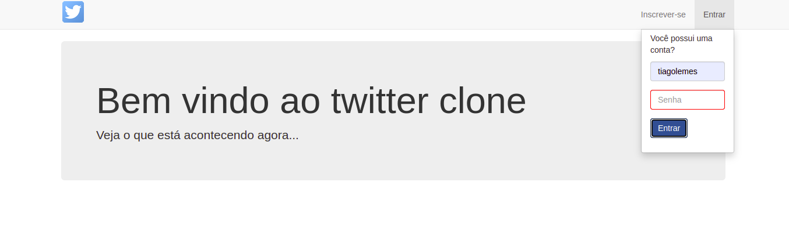
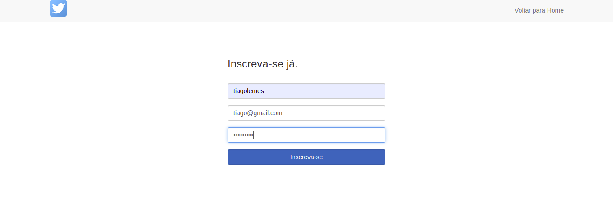

# Twitter clone

## Projeto de estudos que tem a intenção de fazer um clone do website twitter.com.

## Utiliza principalmente jQuery para Javascript, BootStrap para CSS, PHP e SQL com MySQL, com servidor Apache

### Para rodar o projeto é necessário rodar o dump do banco de dados em sua máquina local, foi utilizado SGBD MySQL 

O dump se encontra no arquivo **twitter_clone.sql**

O dump apaga o banco de dados com nome *twitter_clone* e o recria do zero

A conexão com o banco precisa ser ajustada de acordo com seu servidor apache local ou online no arquivo presente em **php/db.class.php**

Depois é só abrir usando o servidor apache

